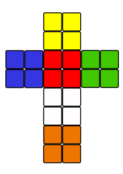
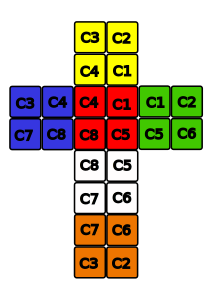

# Solver 2x2 cube by @pibi

## Introduction
This is a simple implementation of a 2x2 rubik's cube solver using Ortega method that uses 12 
algoritms, and some of them are symetrical, so in a few movements we can solve a cube. 

The final achievement is to solve a scrambled rubik's cube. Implementation are made with references and arrays, so that we can save as much time as posible using O(1) space and time complexity for the turns. 

The solver algorithm is a direct implementation of the heuristic: *Tabu Searching* just to build the first face of the cube, this is the first step of the Ortega's algorithm. The heuristic can be developed more, so that you can solve the whole cube using the heuristic. 

Given a cube and its state with specified colors, the program will give the moves for that cube in order to solve it using Rubik's cube notation. 

## Explanation

| |
|-----------------|
| Rubik Map (solved) |

The whole Rubik cube are made of 8 little cubes, we call them Cubies (orientation are given from the picture, front, top, back etc). Each Cubie are named and represented with CX, where X starts from the YRG corner, and surrounds the cube. 

| |
|-----------------|
| Rubik cube |

All cubies have 6 faces. Cubies faces should be preserved when turning the cube. If it represents an inner face of the Cube, reference is *null*. For example, Cubie C1 has colored only **FRONT**, **TOP** and **RIGHT** faces. All other faces of C1 are null. When turing the cube, C1 (and others) must have these faces colored.

## Implementation walkthrough
The steps to achieve the goal are the following: 

1. Build Cubie class. The object that will represent the inner-cubes of the 2x2 cube. We must name the cubbie and give the default state (solved) as a new object of this class. Also a rotation value for each cube, just to make the first step faster (is not necessary at all).
2. Build Cube2x2 class. The object that will have 8 cubies. Turns are made here, all posible turns, but only 1 move (*U, U', F, F'*, etc). Also we need to store the solved cube. We need methods for generate moves (randomly), scramble cube, and excecute them, so we would need an extra class for that. And lastly, and most important, a solve() method that given a cube state, generate a String of movements so that following those steps the cube will be solved. 
3. Finally, an GUI Windows in order to show the rubik's state, and drawing new states when turing the cube. Also it should be a great idea if it's possible (of course is possible, but time) that the user can draw the picture with colors of his own cube, and then see the solving moves. 

## Program achivement
- **INPUT**: A state of cubies [C1 - C8] each one of them colored according to the rules of the cube.
- **OUTPUT**: A sequence of moves, from that state, given the same orientation as the Rubik's Map. Also a verification rule when all colors match as a solved rubik's cube. 

In collaboration with @shosholanda

